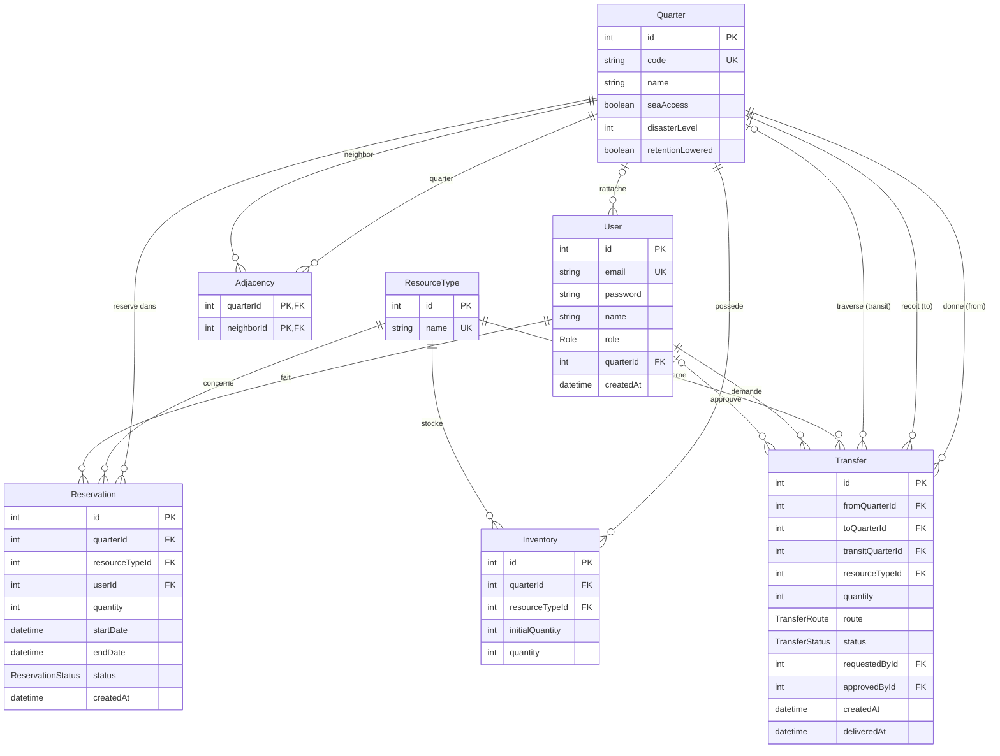

# Diagramme entité-relation

Généré à partir de `prisma/schema.prisma`. Le diagramme s'affiche directement sur GitHub.

## Valeurs des enums

| Enum | Valeurs |
|---|---|
| Role | QC, LC, CD, ADMIN |
| ReservationStatus | PENDING, CONFIRMED, CANCELLED |
| TransferStatus | PENDING, APPROVED, REJECTED, DELIVERED |
| TransferRoute | LAND, SEA |
